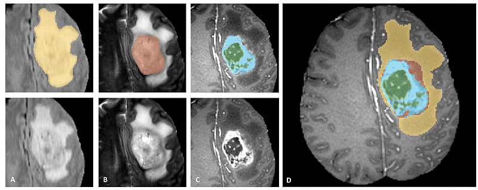

# Lab 3: BRATS and multimodal MRI

This notebook is essentially a copy of the `brats_segmentation_3d.ipynb` notebook from https://github.com/Project-MONAI/tutorials. We will not have time for a detailed introduction to MONAI. Please consult the documentation: https://monai.io.

The tutorial notebook shows how to construct a training workflow of a **multi-labels segmentation task**:<br>

- _Obtain pre-defined biologically/clinically significant subregions of a brain tumor from multiparametric 3D MRI recordings using supervised learning with 3D convolutional deep neural networks_, i.e.

### Multilabel tumor segmentation:  _y_ ≈ f(X;𝜃)

#### Data _X_:

In our case we are using multiparametric magnetic resonance images ([mp-MRI](https://en.wikipedia.org/wiki/MRI_sequence)) recordings from previous BraTS challenges openly available in the **Medical Segmentation Decathlon** ([MSD](https://arxiv.org/abs/2106.05735)) repository (http://medicaldecathlon.com) as `Task01_BrainTumor.tar` (see also https://decathlon-10.grand-challenge.org).

The data set consists of 750 mp-MRI recordings from patients diagnosed with either glioblastoma or lower-grade glioma (LGG). The sequences used were native
T1-weighted (T1), post-Gadolinium (Gd) contrast T1-weighted (T1-Gd), native T2-weighted (T2),
and T2 Fluid-Attenuated Inversion Recovery (FLAIR). The corresponding target ROIs were the
three tumor sub-regions, namely edema, enhancing, and non-enhancing tumor. This data set was
selected due to the challenge of locating these complex and heterogeneously-located targets. The
data was acquired from 19 different institutions and contained a subset of the data used in the
[2016](https://www.smir.ch/BRATS/Start2016) and [here](https://paperswithcode.com/dataset/brats-2016) and [2017](https://www.med.upenn.edu/sbia/brats2017.html) Brain Tumor Segmentation (BraTS) challenges.

There are a total of 740 4D volumes available, 484 four-channel MRI images (`imagesTr` folder) with corresponding multi-label images (`labelsTr`) available for training, and 266 mpMRI recordings (no corresponding labels provided) in the `ìmagesTs`folder. The provided data are distributed after their pre-processing, i.e. co-registered to the same anatomical template, interpolated to the same resolution (1 mm$^3$) and skull-stripped. 

#### Labels and classes _y_:

In this challenge we have the following **labels** for the data:
  - label 0 is non-tumor
  - label 1 is the peritumoral edema
  - label 2 is the necrotic and non-enhancing tumor core
  - label 3 is the GD-enhancing tumor

The possible **classes** are:
  - TC (Tumor core)
  - WT (Whole tumor)
  - ET (Enhancing tumor)

(merging label 2 and label 3 to construct TC, merging labels 1, 2 and 3 to construct WT, and label 3 is ET)


#### Model $f$ and trainable parameters $\theta$:

In our $y  \approx f(X; \theta)$ notation we will for each voxel location $v \in \Omega(X)$ (spatial domain of the multiparametric brain image $X$) have


- $y_v \in \{y_1, y_2, y_3, y_4\}$ = {_TC_, _WT_, _ET_, non-tumor} (these regions are illustrated in the figure below)


- $f$ is a 3D convolutional deep neural net model (i.e. `SegResNet`), and 


- $\theta = (\theta_1, \theta_2, ...., \theta_p)$ is the $p$ trainable model parameters (``synaptic weights") in $f$ (in our `SegResNet` model $p \sim 4.7 \cdot 10^6$), and


- $\approx$ denotes _approximation_ expressed by a loss function or performance metric such as the Dice coefficient for the segmentation, e.g. accross one epoch during training: 

And it contains the following steps:
1. Transforms for dictionary format data.
1. Define a new transform according to MONAI transform API.
1. Load Nifti image with metadata, load a list of images and stack them.
1. Randomly adjust intensity for data augmentation.
1. Cache IO and transforms to accelerate training and validation.
1. 3D SegResNet model, Dice loss function, Mean Dice metric for 3D segmentation task.
1. Deterministic training for reproducibility.

The dataset comes from http://medicaldecathlon.com/.  
Target: Gliomas segmentation necrotic/active tumour and oedema  
Modality: Multimodal multisite MRI data (FLAIR, T1w, T1gd,T2w)  
Size: 750 4D volumes (484 Training + 266 Testing)  
Source: BRATS 2016 and 2017 datasets.  
Challenge: Complex and heterogeneously-located targets

Below figure shows image patches with the tumor sub-regions that are annotated in the different modalities (top left) and the final labels for the whole dataset (right).
(Figure taken from the [BraTS IEEE TMI paper](https://ieeexplore.ieee.org/document/6975210/))



The image patches show from left to right:
1. the whole tumor (yellow) visible in T2-FLAIR (Fig.A).
1. the tumor core (red) visible in T2 (Fig.B).
1. the enhancing tumor structures (light blue) visible in T1Gd, surrounding the cystic/necrotic components of the core (green) (Fig. C).
1. The segmentations are combined to generate the final labels of the tumor sub-regions (Fig.D): edema (yellow), non-enhancing solid core (red), necrotic/cystic core (green), enhancing core (blue).


**Training 300 epochs using a slightly more powerful NVIDIA RTX 6000 GPU workstation:**
```
   epoch 300 average loss: 0.1286
   current epoch: 300 current mean dice: 0.7913 tc: 0.8398 wt: 0.9139 et: 0.6201
   best mean dice: 0.7918 at epoch: 276
   time consuming of epoch 300 is: 272.1563
   CPU times: user 19h 52min 22s, sys: 1h 55min 29s, total: 21h 47min 51s
   Wall time: 22h 27min 4s
   
   train completed, best_metric: 0.7918 at epoch: 276, total time: 80824.40817975998.
```


#### Note on BraTS 2021

- **[NVIDIA Data Scientists](https://developer.nvidia.com/blog/nvidia-data-scientists-take-top-spots-in-miccai-2021-brain-tumor-segmentation-challenge) Take Top Spots in MICCAI 2021 [Brain Tumor Segmentation Challenge](http://www.braintumorsegmentation.org)**:


 - Optimized U-Net for Brain Tumor Segmentation – Rank #1 (based on [`nnU-Net`](https://github.com/MIC-DKFZ/nnUNet) winner of [BraTS 2020](https://www.med.upenn.edu/cbica/brats2020) by [Isense et al.](https://arxiv.org/abs/2011.00848))
  
  
 - SegResNet: Redundancy Reduction in Semantic Segmentation of 3D Brain MRIs – Rank #2<br> The main model is the SegResNet architecture from MONAI, a standard encoder-decoder based convolutional neural network (CNN) similar to U-Net. 
  

  
_A typical segmentation example with predicted labels overlaid overT1c MRI axial, sagittal and coronal slices. The whole tumor (WT) class includes all visible labels (a union of green, yellow and red labels), the tumor core (TC) class is a union of red and yellow, and the enhancing tumor core (ET) class is shown in yellow
(a hyperactive tumor part)._


## Slides and video recordings

_TBA_


## Jupyter Notebooks

[ELMED219-2022-Lab4-BRATS-segmentation-3D-MONAI.ipynb](https://nbviewer.org/github/MMIV-ML/ELMED219-2022/blob/main/Lab4-BRATS/ELMED219-2022-Lab4-BRATS-segmentation-3D-MONAI.ipynb)

## Your turn!

See: https://github.com/MMIV-ML/ELMED219-2021/tree/main/Lab3-BRATS
